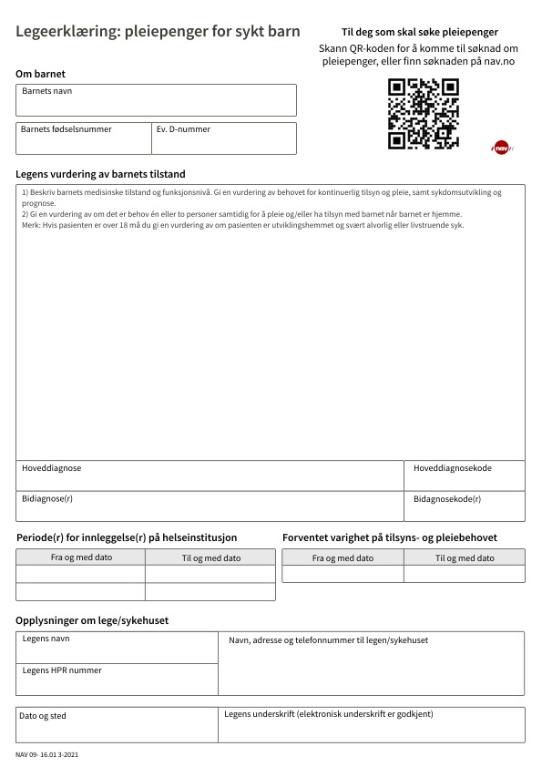

# Eksisterende prosess

## Dataflyt

1. En lege i spesialisthelsetjenesten, for eksempel på et sykehus, skriver en legeerklæring når det er relevant for omsorgspersoner, som vanligvis er foreldre, å søke om pleiepenger for et sykt barn. Årsakene til at legeerklæringen fylles ut kan variere og inkluderer rutinemessig utfylling ved innleggelse på nyfødtintensiven, forespørsler fra foreldre, helsepersonell som sosionomer, eller andre årsaker som ikke nødvendigvis er kjent.

2. Legeerklæringen fylles vanligvis ut ved hjelp av en skjemamotor i EPJ (Elektronisk Pasientjournal) som DIPS Arena eller EPIC, og dokumentet journalføres deretter som enten en PDF eller Word-fil i EPJ-systemet.

3. Legeerklæringen overleveres deretter til omsorgspersonen eller foreldrene til det syke barnet. Dette kan skje på ulike måter avhengig av barnets alder og rutiner ved det aktuelle sykehuset eller avdelingen. Dette kan inkludere utskrift på papir som overleveres på sykehuset eller sendes i posten, journalføring av legeerklæringen på barnets helsejournal som foreldrene kan få tilgang til via helsenorge.no hvis barnet er under 12 år, eller sending av legeerklæringen per e-post til foreldrene.

4. Omsorgspersonen søker deretter om pleiepenger hos NAV og legger ved legeerklæringen enten ved søknadstidspunktet eller ettersender den senere. Det er viktig å merke seg at personen som mottar legeerklæringen ikke nødvendigvis er den samme som søker om pleiepenger. For eksempel kan mor motta legeerklæringen, men det er faren som søker om pleiepenger, og vice versa. I noen tilfeller kan også andre personer, som for eksempel besteforeldre, søke om og få innvilget pleiepenger.

5. Det opprettes en sak på omsorgspersonen eller søkeren, og legeerklæringen journalføres sammen med andre dokumenter i saksbehandlingssystemet for pleiepenger. Hvis det er flere personer som søker om pleiepenger for samme barn, opprettes det separate saker for hver person, men legeerklæringen deles mellom sakene i saksbehandlingssystemet.

6. Saksbehandler i NAV får tilgang til legeerklæringen ved saksbehandling av søkers sak.

## Legeerklæring

Mer utfyllende informasjon om den eksisterende legeerklæringen finnes
på [nav.no](https://www.nav.no/samarbeidspartner/pleiepenger-barn#legeerklering-pleiepenger).
Legeerklæringen består av følgende informasjonselementer:

* Barnets navn
* Barnets fødselsnummer evt. d-nummer
* Legens vurdering av barnets tilstand - Skrives av lege ved utfylling av legeerklæring. Finnes ikke som strukturert
  informasjon i EPJ, men lege kopierer ofte fra en tidligere legeerklæring hvs det er snakk om forlengelse. Hvis det er
  behov for to omsorgspersoner skal lege også begrunne dette.
* Hoveddiagnose og hoveddiagnosekode - [ICD-10](https://www.ehelse.no/kodeverk-og-terminologi/ICD-10-og-ICD-11)
  diagnosekode. Hvis barnet er under utredning og det ikke er fastsatt noen diagnose er det ikke nødvendig å fylle ut
  noe. Benyttes til statisikk.
* Bidiagnose(r) og bidiagnosekode(r) - [ICD-10](https://www.ehelse.no/kodeverk-og-terminologi/ICD-10-og-ICD-11)
  diagnosekode. SKal fylles ut hvis det er registrert bidiagnoser i EPJ.
* Periode(r) for innleggelse(r) på helseinstitusjon (fra og til dato) - Fylles kun ut hvis er/har vært innlagt.
  Informasjonen finnes i EPJ.
* Forventet varighet på tilsyns- og pleiebehovet (fra og til dato) - Lege vurderer hvor lenge barnet har behov for
  kontinuerlig tilsyn og pleie.
* Legens navn
* Legens HPR nummer
* Navn, adresse og telefonnummer til legen/sykehuset
* Dato og sted
* Legens underskrift (elektronisk underskrift er godkjent)

I folketrygdlovens [§ 9-16 Krav til dokumentasjon](https://lovdata.no/lov/1997-02-28-19/§9-16) er følgende beskrevet om
legeerklæringen.
> For å få rett til pleiepenger etter [§ 9-10](https://lovdata.no/lov/1997-02-28-19/§9-10) må det legges fram en
> legeerklæring fra lege i spesialisthelsetjenesten. Det samme gjelder ved forlengelse av pleiepengeperioden.
> Det må dokumenteres at barnet har behov for kontinuerlig tilsyn og pleie på grunn av sykdom, skade eller lyte. Dersom
> det er behov for tilsyn og pleie av to omsorgspersoner, se [§ 9-10](https://lovdata.no/lov/1997-02-28-19/§9-10) andre
> ledd, må dette dokumenteres
