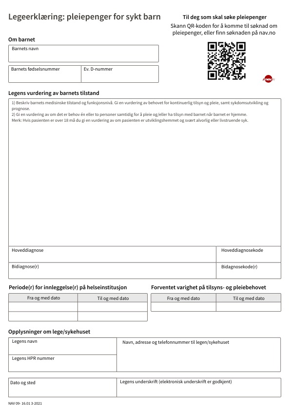

# Eksisterende prosess

## Dataflyt

1. Lege i spesialisthelsetjenesten (sykehus) skriver
   en legeerklæring i de tilfeller det er, eller kan være, relevant for omsorgspersoner (som oftest foreldre) å søke om
   pleiepenger. I alle tilfeller dreier det som et sykt barn, men alvorlighet og tidsperspektiv på diagnose kan variere
   fra beinbrudd til palliativ behandling. Vår innsikt så lang viser at kan være flere «triggere» til at leggerklæringen
   fylles ut:

* Rutiner på sykehus som medfører at det alltid fylles ut en legeerklæring ved innleggelse på nyfødtintensiven.
* Foreldre ber om legeerklæring, særlig vanlig ved behov for legeerklæring til forlengelse av pleiepenger.
* Sosionom eller andre på sykehus ber lege fylle ut legeerklæring.
* Sikkert andre årsaker også som vi p.t. ikke kjenner til.

Dagens skjema ser slik ut:

2. Legerklæringen fylles ut som oftest ut via en "skjemamotor" i EPJ (Elektronisk Pasientjournal – DIPS Arena eller
   EPIC), og journalføres som PDF eller Word i EPJ.
3. Legeerklæringen leveres deretter til omsorgsperson/foreldre. Dette skjer på forskjellige måter avhengig av barnets
   alder og rutiner på det enkelte sykehus/avdeling, bla:

* Utskrift på papir overleveres på sykehuset, evt. sendes i posten.
* Legeerklæringen journalføres på barnet og foreldre kan hente denne på helsenorge.no hvis barnet er under 12 år.
* Legeerklæring sendes til foreldre på mail?
* I noen tilfeller sender sykehus legeerklæring til NAV, men dette er kun unntaksvis.

4. Omsorgsperson søker om pleiepenger og legger ved legeerklæringen på søknadstidspunktet eller ettersender den. Her er
   det verdt å påpeke at den personen som har mottatt legeerklæring ikke nødvendigvis er den samme som søker. Mor kan
   motta legeerklæring og far kan søke, og vice versa. I noen tilfeller er det også andre personer, f.eks.
   besteforeldre, som søker om og får innvilget pleiepenger.
5. Det opprettes en sak på søker/omsorgsperson og legeerklæringen journalføres sammen andre saksdokumenter på søker. I
   de tilfeller det er flere personer som søker om pleiepenger for samme barn opprettes det egne saker for hver person,
   men legeerklæring deles mellom sakene i K9 (Saksbehandlingsløsning for pleiepenger).

## Legeerklæring

Mer utfyllende informasjon om den eksisterende legeerklæringen finnes
på [nav.no](https://www.nav.no/samarbeidspartner/pleiepenger-barn#legeerklering-pleiepenger).
Legeerklæringen består av følgende informasjonselementer:

* Barnets navn
* Barnets fødselsnummer evt. d-nummer
* Legens vurdering av barnets tilstand - Skrives av lege ved utfylling av legeerklæring. Finnes ikke som strukturert
  informasjon i EPJ, men lege kopierer ofte fra en tidligere legeerklæring hvs det er snakk om forlengelse. Hvis det er
  behov for to omsorgspersoner skal lege også begrunne dette.
* Hoveddiagnose og hoveddiagnosekode - [ICD-10](https://www.ehelse.no/kodeverk-og-terminologi/ICD-10-og-ICD-11)
  diagnosekode. Hvis barnet er under utredning og det ikke er fastsatt noen diagnose er det ikke nødvendig å fylle ut
  noe. Benyttes til statisikk.
* Bidiagnose(r) og bidiagnosekode(r) - [ICD-10](https://www.ehelse.no/kodeverk-og-terminologi/ICD-10-og-ICD-11)
  diagnosekode. SKal fylles ut hvis det er registrert bidiagnoser i EPJ.
* Periode(r) for innleggelse(r) på helseinstitusjon (fra og til dato) - Fylles kun ut hvis er/har vært innlagt.
  Informasjonen finnes i EPJ.
* Forventet varighet på tilsyns- og pleiebehovet (fra og til dato) - Lege vurderer hvor lenge barnet har behov for
  kontinuerlig tilsyn og pleie.
* Legens navn
* Legens HPR nummer
* Navn, adresse og telefonnummer til legen/sykehuset
* Dato og sted
* Legens underskrift (elektronisk underskrift er godkjent)

I folketrygdlovens [§ 9-16 Krav til dokumentasjon](https://lovdata.no/lov/1997-02-28-19/§9-16) er følgende beskrevet om
legeerklæringen.
> For å få rett til pleiepenger etter [§ 9-10](https://lovdata.no/lov/1997-02-28-19/§9-10) må det legges fram en
> legeerklæring fra lege i spesialisthelsetjenesten. Det samme gjelder ved forlengelse av pleiepengeperioden.
> Det må dokumenteres at barnet har behov for kontinuerlig tilsyn og pleie på grunn av sykdom, skade eller lyte. Dersom
> det er behov for tilsyn og pleie av to omsorgspersoner, se [§ 9-10](https://lovdata.no/lov/1997-02-28-19/§9-10) andre
> ledd, må dette dokumenteres
