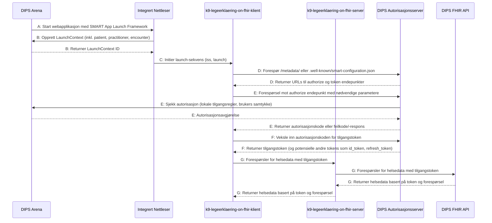

# Oppstart og innlogging
{: .no_toc }



Sekvensdiagrammet over er utarbeidet i [Mermaid Live Editor](https://mermaid.live/edit#pako:eNqdVV1vIjcU_StXfkqlGQJN-IgfViJLaKl22yi0faiQKoe5DI499tT2hM1G-Tn9D_ueP9brYYBJSPqwvIDNucfnnnNlP7KlzZBx5vGfCs0SJ1LkThQLA_QphQtyKUthAlxd_wLCw2R2PYexQyOOIZfObjy6CJuZgLlDF-BXDEEjbR_jx2UZseoi1ZgjOqUFOmny1Jp0tZYuVVqiCW8WppdiqdBk_09Ax96_eXIV1vP6v0NPVbBOeuHvrPHv1U1_nt3sK-rF-Hq2MFsgOZR--NCYwGHMYR6oFjZ4K8pSS1VzQ4EZzD-Pb36v-_8kKrNcw5Q8x411akvVkBAdkXK45PBbWTpyssF_tOTvlwAn0ijdIYkhGpVA6cQyyCCtQZcA5WkrArofDgLbCon2BkPlCPyKdzZ5rYO0cvjIKViiJ7yu8WSwukfjSYj3SbPZnBZDorq90xwmHKbWoS-fvzk4LTCITARxCqg1MXY29J0qYzfm1BdkXLq0ZiXzyonYUOfO28boA2e6UzZptfLHzScPQWoQhKNMvyLYHIKlcSFLMiwro8Iu3WOVVy2VHjUUNrSY9gR1jub5W0b9ZzLHOCeUIRHjkcomRmKe36FSkW4_a3CirRIao-JcmNw7zHVM79ZVCp0HL4rwoBS-DPGV4hfTK-7zOxKP2uO7hl21DGvL8YrugyaRFUodl6dptIP-e8-yKYc_UXlqQhpzTGdgZd2-vzqId3VNW7peVMAJhVjaQNMmozwQJnO4jZVMsgXI7O96lYDDFSleb5cvx_Fwc3D4qZ103TDJXEfb4lzWAb8l-kBBhPES-F6mWJu-IWpvwIHhVvh4mZbP_zaDTGasWlN6LG1n6PfxsYQV6AohM3obHiP7goU1FrhgnH5muBKVDgu2ME8EjYnPH8yS8eAqTFhV0iG7p4TxlaBjd7tXmaTx2G_StfqXtUV7zfgj-8J42huMOv3RYNAfdkfDs4teL2EPjP_YO-v0z7vnF4PuaNTr9Z4S9rUm6HZGg7OLYfe8P-p3h_2z4ShhWB_2efvE1S_d038pJmoc), og viser hva som skjer når en lege starter SMART on FHIR applikasjonen (legeerklæring pleiepenger sykt barn) inne fra DIPS Arena. En fullskjermsvisning av diagrammet finnes [her](https://mermaid.live/view#pako:eNqdVU1v4zYQ_SsDnlJAcuwm_ggPCzjruHWx2wZx20NhoGCsscyQIlWSijcb5Of0P-w9f6xDWbHlOOlhfZEpvXl8896AfGRLmyHjzOM_FZolTqTInSgWBuhXChfkUpbCBLi6_gWEh8nseg5jh0YcQy6d3Xh0ETYzAXOHLsCvGIJGen2MH5dlxKqLVGOO6JQW6KTJU2vS1Vq6VGmJJrxZmF6KpUKT_T8BbXv_5s5VWM_rb_ueqmCd9MLfWePfq5v-PLvZVdSL8fVsYbZAcij98KExgcOYwzxQLWzwVpSllqrmhgIzmH8e3_xe9_9JVGa5hil5jhvr1JaqISE6IuVwyeG3snTkZIP_aMnfLwFOpFG6QxJDNCqB0ollkEFagy4BytNWBHQ_7AW2FRLtDYbKEfgV72zyWgdp5fCRU7BET3hd48lgdY_GkxDvk-Zls1sMiep2TnOYcJhah758_ubgtMAgMhHEKaDWxNjZ0DNVxm7MqS_IuHRpzUrmlROxoc6dt43Re870Rdmk1cofN588BKlBEI4y_YpgcwiWxoUsybCsjAov6R6rvGqp9KihsKHFtCOoczTP3zLqP5M5xjmhDIkYj1Q2MRLz_A6VinS7WYMTbZXQGBXnwuTeYa5jereuUug8eFGEB6XwMMRXig-mV9zndyQetcd3DbtqGdaW4xWdB00iK5Q6Lk_TaAd9e8-yKYc_UXlqQhpzTGdgZd2uvzqId3VNW7oOKuCEQixtoGmTUR4Ikzncxkom2QJk9ne9SsDhihSvt8vDcdyfHBx-aiddN0wy19G2OJd1wG-J3lMQYTwEvpcp1qZviNoZsGe4FT4epuXzv80gkxmr1pQeS3sx9Pv4WMIKdIWQGd0Nj5F9wcIaC1wwTn8zXIlKhwVbmCeCxsTnD2bJeHAVJqwqaZOXq-Tw5VUmaToYXwmSkjA6Vf-ytmivGX9kXxhPe4NRpz8aDPrD7mh4dtHrJeyB8R97Z53-eff8YtAdjXq93lPCvtYE3c5ocHYx7J73R_3usH82HCUM680-b2-4-qJ7-g-912nR).
Sekvensdiagrammet tar utgangspunkt i [implementasjonsguide SMART App Launch Framework](https://helsenorge.atlassian.net/wiki/spaces/HELSENORGE/pages/67469415/Implementasjonsguide+SMART+App+Launch+Framework) utarbeidet av Norsk Helsenett.

### Innholdsfortegnelse
{: .no_toc }

- TOC
{:toc}

## Involverte komponenter
- DIPS Arena. EPJ fra DIPS kjørende Helse Vest's produksjonsmiljø. Kan i teorien være hvilken som helst EPJ som støtter SMART on FHIR, men løsningen er utvikliet i samarbeid med DIPS og p.t. bare testet med DIPS Arena.
- Integrert nettleser. Nettleser som kjører inne i DISP Arena. SAMRT on FHIR applikasjoner som vises i denne nettleseren kommer opp som en egen fane i DIPS Arena.
- k9-legeerklaering-on-fhir-klient. Typescript kode som kjører i den integrerte nettleseren i DIPS Arena. Utviklet av NAV, kildekoden finnes på [GitHub](https://github.com/navikt/k9-legeerklaering-on-fhir) 
- k9-legeerklaering-on-fhir-server. 

## A og B: Opprett LaunchContext og start webapplikasjon
DIPS opprettet LauchContext og benytter integrert nettleser for å starte webapplikasjonen med [SMART App Launch Framework](https://www.hl7.org/fhir/smart-app-launch/). Vet ikke i detalj hvordan DIPS gjør dette, eller om rekkefølgen er korrekt i sekvensdiagrammet, men det er ikke så vesentlig for denne dokumentasjonen. Det viktigste her er å få frem samspillet mellom de forskljellige komponentene DIPS og NAV er ansvarlige for.

## C: Initier launch-sekvens
Den integrerte nettleseren i DIPS utfører en HTTP GET-forespørsel til https://k9-legeerklaering.ekstern.dev.nav.no/, som er adressen til SMART on FHIR-applikasjonen i testmiljøet, med 'iss' og 'launch' som forespørselsparametere.
- iss: Identifiserer FHIR-endepunktet til elektronisk pasientjournal (EPJ). Webapplikasjonen benytter dette endepunktet for å innhente flere opplysninger om EPJ, inkludert nettadressen til autorisasjonstjeneren.
- launch: Fungerer som en unik identifikator for den aktuelle oppstartprosessen. Dette parameteret må formidles tilbake til EPJ ved tidspunktet for autorisasjon.


## Access token (Payload)
```json
{
 nbf: 1709122957,
 exp: 1709126557,
 iss: "https://api.dips.no/dips.oauth",
 aud: [
  "https://api.dips.no/dips.oauth/resources",
  "patient/*.read",
  "launch",
  "fhirUser"
 ],
 client_id: "NAV_legeerklaering",
 sub: "82e685ca-c0f6-064e-b418-80bb6f28606d",
 auth_time: 1709122956,
 idp: "local",
 name: "NAV-ERIK",
 dips-ticket: "fa23bf6a-e05d-4173-93f9-01c90c36ab58",
 dips://ticket: "fa23bf6a-e05d-4173-93f9-01c90c36ab58",
 hpr-nummer: "987654",
 dips-firstname: "ERIK",
 dips-lastname: "NAV",
 dips-userid: "2018663",
 dips-username: "NAV-ERIK",
 dips-userinuse: "True",
 dips-userwrongpasswordcount: "0",
 dips-userpasswordchangedtime: "3999-12-31T00:00:00.0000000",
 dips-userissystemuser: "False",
 dips-userlastlogintime: "2024-02-22T09:58:49.0000000",
 dips-userpersonproxyid: "82e685ca-c0f6-064e-b418-80bb6f28606d",
 dips-userroleid: "1010248",
 dips-userrolename: "NAV-ERIK Full funksjonstilgang og VID datatilgang (BT)",
 dips-userrolehospital: "1",
 dips-hcpid: "1004491",
 dips-userroledepartment: "22",
 dips-userroleguid: "c1ec1da6-2c7b-344d-98fb-5db6e11a42ff",
 dips-audit-corr-id: "5a545476-03e7-4fa5-9bd4-2de410f7798f",
 scope: [
  "openid",
  "profile",
  "patient/*.read",
  "launch",
  "fhirUser"
 ],
 amr: [
  "pwd"
 ]
}
```
[Validering av token](https://github.com/navikt/k9-legeerklaering-on-fhir/blob/6d04905f554bca06e40aad18368d0304c21cd767/src/auth/fhir/FhirSession.ts#L35)
