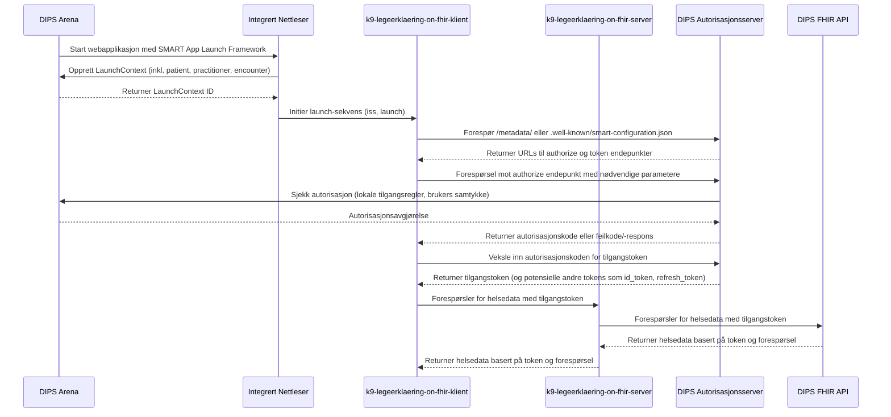

# Oppstart og innlogging

[Mermaid Live Editor](https://mermaid.live/edit#pako:eNqdVclu2zAU_BWCpxSQvNTxpkMAp0lQF2kb2G0PhYGCkZ5lmhSpklScBfmc_kPu-bE-yvIWZynqi0163nDezBN1R2OdAI2ohd8FqBhOOEsNyyaK4CdnxvGY50w5cnrxiTBLToYXYzIwoNg-5NjohQXjYUPlIDVgHPkCzknA7X38IM89VvRDCSmAEZKB4SoNtQqnM25CITko92xheMxiASp5nQCPvXr25MLNxuV_m54Kpw23zM61si_VnX0cjtYV5WJwMZyoJRAdCo-OKhMiMnZYSBZwyfJcclESkwwSMv48GH0rmz9nhYpn5AwNh4U2YslTMSAXMkbka54b9LACf9Do7LUjB1wJWUNxzlsUkNyw2HHHtQITEExSFwg07zbStrWNwBUGkU9IhydPFaDKCMNEYgTLEoymiitQFiVYG1Sb1Tk-GCxauxuRM23A5o8PhtQzcCxhjtUJSIl0tQV-h0LpharbDM0KY62mPC0M833U5lZXzm4Iw5WmdQffR-eWOC4JQxAmeAtEp8RpHA60IYG8UMKtsnxFnwVJMu22aNbVZWrq8SHBthOegh8JTAxZYU9fFdp4DkJ4rvVMkQOpBZPgtaZMpdZAKn1Wl6YQYCyxLHM3QsBuZNtad0aUXaVzlA3SwtsmbQuxAp_4KoIpcOmX9dC7gP-9ZNMPEBa1c6X2uRSZarNuq3T-bUU7cHKAkeXa4VRxL4wwlRhYhojG6Izw5Fe5CoiBKWqdLZe7Y7e5FbZzLftEgTNvlZ-_Ms7n5G7qkc0_3f9F4wvDp3LWfW_KL5n192P--KeaVvRgujWN-6L2TPx3MhrQDEzGeIJ3_Z2nnlA3gwwmNMKfCUxZId2ETtQ9Qn3E4xsV08iZAgJa5HjI6tVAoynDY1e7pwnHeVhv4jX5U-tsVYlLGt3RaxqFzU6v1u51Ou1uo9dt9ZvNgN7Q6H2zVWsfNg77nUav12w27wN6W9Y3ar1Oq99tHLZ77Ua33er2AgrlWZ-Xb6zyxXX_F28xX-U)
