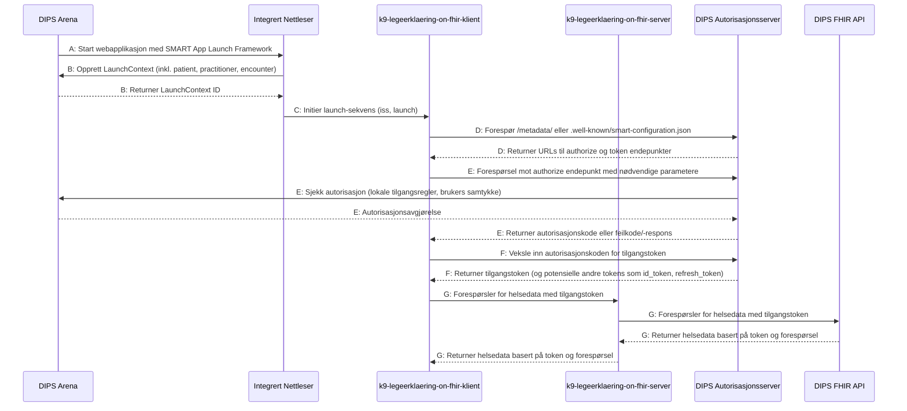

# Oppstart og innlogging

[Mermaid Live Editor](https://mermaid.live/edit#pako:eNqdVV1vIjcU_StXfkqlGQJN-IgfViJLaKl22yi0faiQKoe5DI499tT2hM1G-Tn9D_ueP9brYYBJSPqwvIDNucfnnnNlP7KlzZBx5vGfCs0SJ1LkThQLA_QphQtyKUthAlxd_wLCw2R2PYexQyOOIZfObjy6CJuZgLlDF-BXDEEjbR_jx2UZseoi1ZgjOqUFOmny1Jp0tZYuVVqiCW8WppdiqdBk_09Ax96_eXIV1vP6v0NPVbBOeuHvrPHv1U1_nt3sK-rF-Hq2MFsgOZR--NCYwGHMYR6oFjZ4K8pSS1VzQ4EZzD-Pb36v-_8kKrNcw5Q8x411akvVkBAdkXK45PBbWTpyssF_tOTvlwAn0ijdIYkhGpVA6cQyyCCtQZcA5WkrArofDgLbCon2BkPlCPyKdzZ5rYO0cvjIKViiJ7yu8WSwukfjSYj3SbPZnBZDorq90xwmHKbWoS-fvzk4LTCITARxCqg1MXY29J0qYzfm1BdkXLq0ZiXzyonYUOfO28boA2e6UzZptfLHzScPQWoQhKNMvyLYHIKlcSFLMiwro8Iu3WOVVy2VHjUUNrSY9gR1jub5W0b9ZzLHOCeUIRHjkcomRmKe36FSkW4_a3CirRIao-JcmNw7zHVM79ZVCp0HL4rwoBS-DPGV4hfTK-7zOxKP2uO7hl21DGvL8YrugyaRFUodl6dptIP-e8-yKYc_UXlqQhpzTGdgZd2-vzqId3VNW7peVMAJhVjaQNMmozwQJnO4jZVMsgXI7O96lYDDFSleb5cvx_Fwc3D4qZ103TDJXEfb4lzWAb8l-kBBhPES-F6mWJu-IWpvwIHhVvh4mZbP_zaDTGasWlN6LG1n6PfxsYQV6AohM3obHiP7goU1FrhgnH5muBKVDgu2ME8EjYnPH8yS8eAqTFhV0iG7p4TxlaBjd7tXmaTx2G_StfqXtUV7zfgj-8J42huMOv3RYNAfdkfDs4teL2EPjP_YO-v0z7vnF4PuaNTr9Z4S9rUm6HZGg7OLYfe8P-p3h_2z4ShhWB_2efvE1S_d038pJmoc)
